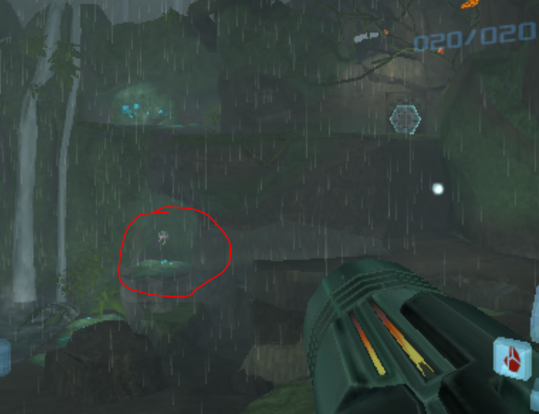

# Unhundred%
Samus starts with all her items, but when you reach a pickup it gets removed!!!

Made using toasterparty's fanhack patching tools

- [Download](https://github.com/JeffGainsNGames/mp1-unhundred/releases/download/v0.1/mp1-unhundred-v0.1.zip)

## Goal
Return all 100 items to their vanilla locations then finish by collecting the nulltroid in Tallon:Landing Site

## Notes

### QoL
- Backwards Labs, Frigate, Mines ARE OFF

### Current Softlock Patches
- Doors to Chapel of Elders, Antechamber, and Plasma Processing now blue
- Boxes added to Burn Dome Access to escape without bombs
